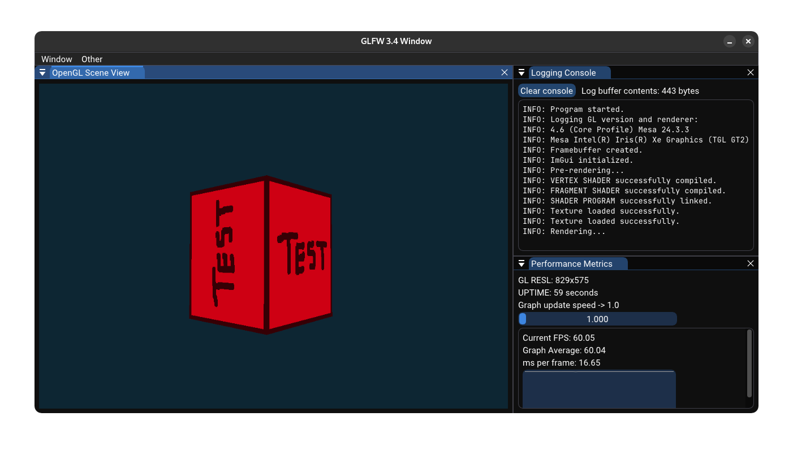

# Simple Math Game

An OpenGL renderer written in C++ with an ImGui docking interface.




## Development prerequisites

This project was developed using Eclipse CDT, but it uses CMake so any IDE (and platform) that supports C++ is compatible.

Prerequisites:
- CMake (preferably 3.30.5 or above)
- An IDE (or text-editor + environment) that's suitable for C++ development


## Setup

You can clone this repository by opening a terminal and typing ```git clone https://github.com/gjinrexhaj/opengl-renderer```.

Once cloned, you may use CMake (the CLI tool or CMake GUI) to configure the project and generate the build files for your platform/target. Specify the root of the project as the source directory as that's where the one and only ```CMakeLists.txt``` file resides. It's recommended you also set the build destination in it's own folder or things will get messy.

All of this project's associated dependencies are included in ```external/```, and linked as specified in ```CMakeLists.txt```.

## Project Structure

This project follows a flat structure, that is, every application header and it's associated implementation file is located under ```src/``` as illustrated below:

```
src
├── Camera.cpp
├── Camera.h
├── FrameBuffer.cpp
├── FrameBuffer.h
├── framework.cpp
├── framework.h
├── graphics.cpp
├── graphics.h
├── Logger.cpp
├── Logger.h
├── main.cpp
├── Shader.cpp
├── Shader.h
├── shaders
│   ├── fragment_shader.frag
│   └── vertex_shader.vert
├── TextureLoader.cpp
└── TextureLoader.h
```

The ```shaders``` folder contains GLSL fragment and vertex shaders which are then compiled and linked at runtime via ```Shader.cpp```.

```framework.cpp``` contains all ImGui UI code.

```graphics.cpp``` contains all OpenGL code.

```main.cpp``` is the launching point of the program which contains the main loop (and calls ```framework.cpp``` and ```graphics.cpp```). This is also where GLFW and Glad is initalized.

All other files' names are implicative of their function, please note that ```Logger.cpp``` will create and write all console outputs to ```logfile.txt``` in the current working directory. Logs aren't automatically removed so you may need to delete them every on occcasion.


